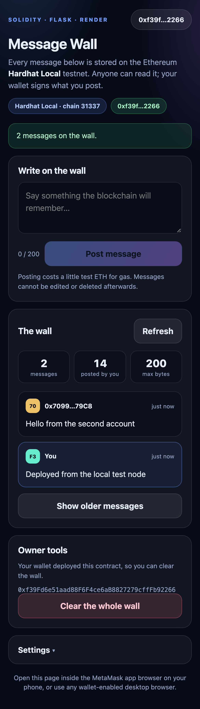

# Message Wall — a Solidity dApp deployed on Render

A public guestbook that lives on the Ethereum **Sepolia** testnet. Flask serves the page; the
visitor's own wallet signs every transaction. The server never holds a private key.



This is a self-contained second dApp (separate from `simple-storage-dapp`). It exercises most of
the Solidity features from the *W3 to 4 Solidity and DAPP Programming* slides and is built
phone-first, so it is comfortable to use from a handphone.

| | |
| --- | --- |
| **Contract** | `contracts/MessageWall.sol` — `struct`, dynamic array, `mapping`, `immutable`, a custom `modifier`, custom `error`s, `event`s |
| **Backend** | Flask + gunicorn, deploying as a Render **Web Service** |
| **Frontend** | HTML/CSS/JS + ethers.js v6. Reads over a public RPC (works with no wallet at all); writes are signed by the visitor's wallet |
| **Phone** | Mobile-first layout, 48 px touch targets, safe-area padding, live byte counter, and the contract address is pre-filled so nobody types 42 characters on a phone |

## Contents

```
app.py                     Flask app: serves the page, exposes /health
requirements.txt           Flask + gunicorn
render.yaml                Render Blueprint (one-click deploy)
Procfile                   start command for other hosts
templates/index.html       the page (server injects the config)
static/app.js              all blockchain logic (ethers.js v6)
static/style.css           mobile-first styling
static/favicon.svg         icon
contracts/MessageWall.sol  the smart contract
contracts/MessageWall.json compiled ABI + bytecode (checked in, so deploy.js works without solc)
docs/                      screenshots
tools/                     development helpers — not needed by Render (see "Tests")
```

## 1. Deploy the contract (Remix, ~3 minutes)

Remix VM runs only inside Remix, so its address cannot be reached by a hosted website. You must
deploy to a public testnet.

1. Open <https://remix.ethereum.org> and create `contracts/MessageWall.sol`.
2. Paste the contents of `contracts/MessageWall.sol`.
3. **Solidity Compiler** tab → compiler `0.8.26` → **Compile MessageWall.sol**. Confirm it
   compiles without warnings.
4. **Deploy & Run Transactions** tab → *Environment*: **Injected Provider - MetaMask**, and make
   sure MetaMask is on **Sepolia**. Remix shows the network next to the environment.
5. You need a little Sepolia ETH for gas — get it free from
   <https://www.alchemy.com/faucets/ethereum-sepolia> or
   <https://cloud.google.com/application/web3/faucet/ethereum/sepolia>.
6. Click **Deploy**, confirm in MetaMask, then copy the **contract address** from the
   *Deployed Contracts* list. Leave *Verify Contract on Explorers* unchecked.
7. The wallet that deployed it is the **owner** — the only wallet that may clear the wall.

## 2. Deploy the site on Render

Put this folder in a GitHub repository first, with `app.py`, `requirements.txt`, `templates/` and
`static/` at the repository root.

### Option A — Blueprint (recommended, one click)

1. Render Dashboard → **New** → **Blueprint**.
2. Pick your repository. Render reads `render.yaml` automatically.
3. When prompted, paste the values for the two `sync: false` variables:
   * `CONTRACT_ADDRESS` — the address you copied from Remix.
   * `SEPOLIA_RPC_URL` — optional; leave blank to use the built-in public endpoints.
4. Click **Apply**. The free web service is created and deployed.

### Option B — manual web service

| Setting | Value |
| --- | --- |
| Type | Web Service |
| Language / Runtime | Python 3 |
| Build Command | `pip install -r requirements.txt` |
| Start Command | `gunicorn app:app --bind 0.0.0.0:$PORT` |
| Instance Type | Free |
| Region | Singapore (closest to Singapore) |

Add `CONTRACT_ADDRESS` (and optionally `SEPOLIA_RPC_URL`) under **Environment**, then create the
service. In both options, add `WALL_TITLE` if you want a different heading.

## 3. Use it from a handphone

1. Wait for the Render deploy to finish and open the `https://<name>.onrender.com` URL.
2. Open that same URL **inside the MetaMask app**: MetaMask → ☰ → **Browser** → paste the URL.
   A normal phone browser has no wallet, so it can read the wall but not post.
3. Tap **Connect wallet** and approve. If your wallet is on another network the app offers to
   switch to Sepolia.
4. Type a message and tap **Post message**, then confirm the transaction. When it is mined the
   message appears at the top of the wall. Read-only visitors need no wallet at all.

## Environment variables

| Variable | Required | Default | Purpose |
| --- | --- | --- | --- |
| `CONTRACT_ADDRESS` | no | *(empty)* | Pre-fills the contract address. Without it the app shows a one-time setup card. |
| `SEPOLIA_RPC_URL` | no | four public endpoints | Comma-separated RPC list, tried in order. Add an Infura/Alchemy URL for a dedicated endpoint. |
| `WALL_TITLE` | no | `Message Wall` | Page heading. |
| `WALL_SIZE` | no | `50` | How many recent messages to load (1–200). |
| `MAX_TEXT_LENGTH` | no | `200` | Byte limit shown in the UI. Must match the constant in the contract. |
| `CHAIN_ID` | no | `11155111` | Sepolia. |
| `CHAIN_NAME` | no | `Sepolia` | Name shown in the UI. |
| `BLOCK_EXPLORER` | no | `https://sepolia.etherscan.io` | Explorer link. |

## Tests

`tools/` holds the development helpers. They are **not** part of the Render service — Render only
installs `requirements.txt`.

```bash
cd tools && npm install

npm run compile        # compile the contract with solc and refresh contracts/MessageWall.json
LOCAL_RPC=http://127.0.0.1:8545 npm run test:contract   # 29 checks on the hardhat EDR EVM
```

The suites are:

* **`test:contract`** — deploys to an in-process EVM and checks reads, writes, events, the byte
  limit, UTF-8 text, and `onlyOwner` enforcement. It reads the ABI straight out of
  `static/app.js`, so if the front end and the contract ever drift apart this fails.
* **`test:browser`** — loads the running Flask app in real Chrome at a 390×844 phone viewport and
  asserts the wall renders, the stats are right, there is no horizontal overflow, and there are no
  console errors.
* **`test:wallet`** — drives the whole UI with a `window.ethereum` shim pointed at a local hardhat
  node: connect → post → confirm → clear.
* **`check:rpcs`** — loads the app in Chrome and proves every configured RPC endpoint answers
  `eth_chainId`, `eth_blockNumber` and `eth_call` **cross-origin**. Public endpoints get retired
  and some omit CORS headers, which breaks in-page reads; run this against your deployed URL if
  the wall stops loading.

```bash
npm run check:rpcs https://your-app.onrender.com
```

The browser suites need a local chain and a running server:

```bash
npm run chain                    # terminal 1: local EVM on 127.0.0.1:8545
npm run deploy:local             # terminal 2: deploy + seed, prints the address
CONTRACT_ADDRESS=<address> CHAIN_ID=31337 CHAIN_NAME="Hardhat Local" \
  SEPOLIA_RPC_URL=http://127.0.0.1:8545 \
  ../.venv/bin/gunicorn app:app --bind 127.0.0.1:5099   # terminal 3
npm run test:browser http://127.0.0.1:5099
npm run test:wallet  http://127.0.0.1:5099
```

## Troubleshooting

| Symptom | Cause and fix |
| --- | --- |
| First load takes ~1 minute | Render's free instance sleeps after ~15 minutes idle and cold-starts on the next request. Reload once. |
| "No MessageWall contract was found at that address" | The address is wrong, or your wallet and the app are pointed at different networks. Deploy on Sepolia and make sure `CONTRACT_ADDRESS` is the Sepolia address. |
| "Not enough Sepolia ETH to pay for gas" | Get free test ETH from a Sepolia faucet. |
| "Only the wallet that deployed this contract can do that" | Clearing the wall is restricted to the contract owner. |
| Connect does nothing on a phone | You are in a normal browser, not the MetaMask in-app browser. Wallet features need a wallet-injected browser. |
| Reading works but posting does not | The site can read over a public RPC with no wallet, but posting always needs a signed transaction. |

## Notes and limitations

* The wall is **public** — anyone with Sepolia ETH can post, and every message is permanently
  visible on Etherscan. Do not post anything private.
* `clear()` removes all messages at once; there is no per-message delete.
* `postCount` is cumulative and intentionally survives a `clear()`.
* Messages are limited to 200 **bytes** (not characters), which is why the counter counts UTF-8
  bytes. Emoji and Chinese text therefore use more than one byte each.
* This targets a testnet. Nothing here is audited; do not put value on it.

## Licence

MIT.
